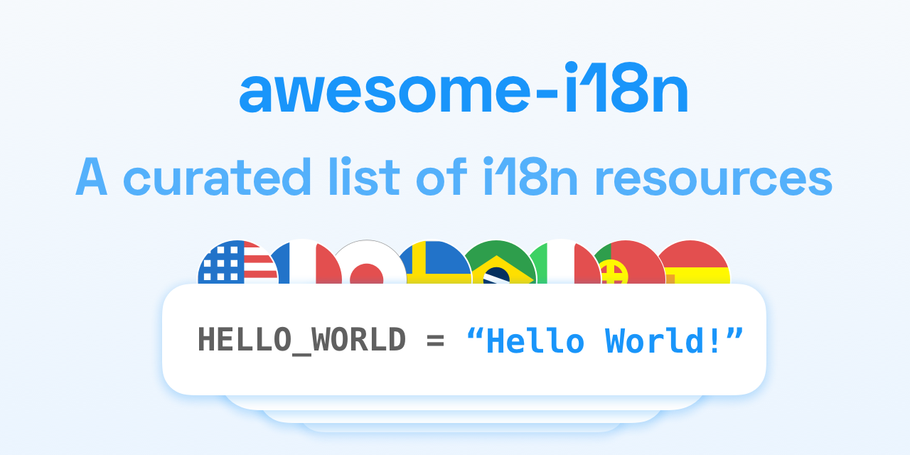
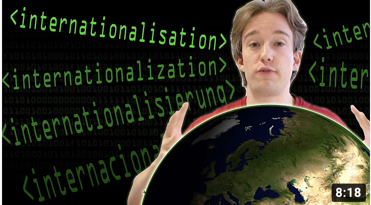

# awesome-i18n 

> A curated list of i18n tools, i18n libraries, localization software, localization programs and translation management systems.

If you want to add something just modify [README.md](README.md) file and wait for a merge ☺️ Enjoy!

### Remember to give this repo a star! 🌟

#### Contents

- [👩‍🎓 Acronyms and keywords](#-acronyms-and-keywords)
- [🕵️ SEO i18n](#%EF%B8%8F-seo-i18n)
- [📚 Libraries](#-libraries)
- [⚛️ React localization](#%EF%B8%8F-react)
- [👩‍💻  Tools & Services](#-tools-and-services)
- [📅 Dates & Times](#-dates-and-times)
- [📞 Telephone](#telephone)
- [📒 Blog posts & articles](#-blog-posts-articles--others)
- [🦮 Guides](#-guides)
- [💭 Community Tips & tricks](#-community-tips--tricks)
- [✍️ Translation agencies](#%EF%B8%8F-translation-agencies)
- [🦾 Automated translations](#-automated-translations)
- [🍿 Videos](#-videos)

## 👩‍🎓 Acronyms and keywords

### 🧐 Acronyms
* i18n - internationalization
* l10n - localization
* xl8 - group of [translation management systems](#translation-management-system)
* t9n - translation
* g11n - globalization
* m17n - multilingualization
* ICU - International Components for Unicode
* TMS - translation management system
* GMS - globalization translation system (same thing as TMS)

### 🔑 Keywords
* translation key - element in source code which is used by i18n library to replace it with translation message
* translation - translated text or message

## 📚 Libraries

### JavaScript

* [ECMAScript Internationalization API](https://developer.mozilla.org/en-US/docs/Web/JavaScript/Reference/Global_Objects/Intl) documentation what standard `intl` object in JS can do.
* [Facebook FBT](https://github.com/facebook/fbt) FBT is an internationalization framework for JavaScript designed to be not just powerful and flexible, but also simple and intuitive
* [js-lingui](https://github.com/lingui/js-lingui) A readable, automated, and optimized (5kb) internationalization
* [Globalize](https://github.com/jquery/globalize) library for i18n that leverages the official Unicode CLDR JSON data
* [Intl.js](https://github.com/andyearnshaw/Intl.js) implementation of the ECMAScript Internationalization API
* [Jed](http://slexaxton.github.io/Jed/) Gettext Style i18n
* [FormatJS](https://formatjs.io) internationalize your web apps on the client & server
- [FormatJS CLI](https://formatjs.io/docs/tooling/cli/) Extract messages from project with FormatJS library
* [googlei18n/libphonenumber](https://github.com/googlei18n/libphonenumber) Google's common Java, C++ and JavaScript library for parsing, formatting, and validating international phone numbers
* [International Telephone Input](http://jackocnr.com/intl-tel-input.html) plugin for entering and validating international telephone numbers. 
* [lisan.js](http://lisanjs.com) fast and small i18n library
* [Polyglot.js](http://airbnb.io/polyglot.js/) Make your application speak multiple languages
* [ttag](https://ttag.js.org/) library for translations based on ES6 template literals
- [i18n Ally](https://github.com/antfu/i18n-ally) - Extension for VSCode, all in one about i18n.
* [Angular NGX Translate](http://www.ngx-translate.com) Angular translation library
- [npm i18n](https://www.npmjs.com/package/i18n) - Lightweight simple translation module with dynamic json storage.
* [vue i18n](https://kazupon.github.io/vue-i18n/) Vue I18n is internationalization plugin for Vue.js
- [MDN i18n](https://developer.mozilla.org/en-US/docs/Mozilla/Add-ons/WebExtensions/API/i18n) - Functions to internationalize your browser extension. You can use these APIs to get localized strings from locale files packaged with your extension.
- [Quasar I18n](https://quasar.dev/options/app-internationalization) - App internationalization (i18n) in Quasar framework.
- [eo-locale](https://github.com/ibitcy/eo-locale) Elegant lightweight library based on Internationalization API
- [i18next](https://www.i18next.com) - A very popular internationalization framework for browser or any other javascript environment (eg. Node.js, Deno).

### ⚛️ React
React apps and react localization is so popular so we decided to add a special section for it. Here is the list of react localization libraries:  

* [react-translate](https://github.com/bloodyowl/react-translate) Internationalization for react
- [react-native-localize](https://github.com/zoontek/react-native-localize) A toolbox for your React Native app localization
* [FormatJS](https://formatjs.io) internationalize your web apps with react-intl library
- [FormatJS CLI](https://formatjs.io/docs/tooling/cli/) Extract messages from project with FormatJS library
- [react-localization](https://github.com/stefalda/react-localization) Simple module to localize the React interface using the same syntax used in the ReactNativeLocalization module.
- [react-i18nify](https://github.com/sealninja/react-i18nify) Simple i18n translation and localization components and helpers for React
- [react-persian](https://github.com/evandhq/react-persian) react-persian is a set of react components for Persian localization
- [react-i18next](https://react.i18next.com/) - internationalization framework for React / React Native which is based on i18next
- [next-translate](https://github.com/vinissimus/next-translate) Easy i18n for Next.js +10
- [react-translated](https://github.com/amsul/react-translated) A dead simple way to add complex translations in a React project
- [react-intl hooks](https://github.com/CreateThrive/react-intl-hooks) React-intl-hooks is a small and fast library that you can use to replace Format.js components. 
- [react-localize-redux](https://github.com/ryandrewjohnson/react-localize-redux) Localization library for handling translations in React.
- [js-lingui](https://github.com/lingui/js-lingui) A readable, automated, and optimized (5 kb) internationalization for JavaScript
- [react-translate-component](https://github.com/martinandert/react-translate-component) 
Translate is a component for React that utilizes the Counterpart module and the Interpolate component to provide multi-lingual/localized text content.
- [react-littera](https://github.com/DRFR0ST/react-littera) A lightweight library for robust translations using hooks. Some of the key features are dynamic templates, missing reports, auto locale detection and more

### Java 

* [Thymeleaf](https://www.thymeleaf.org) - modern server-side Java template engine for both web and standalone environments.
* [Spring Messages](https://www.baeldung.com/spring-boot-internationalization) Spring Boot internationalization. LocaleResolver & LocaleChangeInterceptor example usage. 
* [Thymeleaf i18n docs](https://www.thymeleaf.org/doc/tutorials/3.0/usingthymeleaf.html#using-texts) using `th:texts` for translations
* [Spring Boot localization](https://www.baeldung.com/spring-boot-internationalization) Baeldun post about using Spring Messages
* [i18n in Spring Boot](https://stackoverflow.com/questions/36531131/i18n-in-spring-boot-thymeleaf) Stackoverflow thread

### Jekyll

* [jekyll-multiple-languages-plugin](https://github.com/kurtsson/jekyll-multiple-languages-plugin) - Jekyll Multiple Languages is an internationalization plugin for Jekyll.
* [jekyll-i18n](https://github.com/liamzebedee/jekyll-i18n) - Jekyll i18n is a plugin that enables simplistic multi-language site designs using Jekyll. (not maintained)

### Swift (iOS & macOS)

- [SwiftGoogleTranslate](https://github.com/maximbilan/SwiftGoogleTranslate) - A framework to use cloud translation API by Google in Swift.

### Ruby

* [TwitterCLDR](https://github.com/twitter/twitter-cldr-rb) implementation of the ICU that uses the Common Locale Data Repository to format dates, plurals
- [Ruby I18n](https://guides.rubyonrails.org/i18n.html) - Rails internationalization (i18n) API.

### Python

- [Python-i18n](https://pypi.org/project/python-i18n/) - Python internationalization (i18n) package.
- [deep-translator](https://github.com/nidhaloff/deep-translator) - a flexible free and unlimited (depending on the translator used) library written in Python to translate between different languages in a simple way using multiple translators, it can also be used directly in the prompt.

## 🔦 Message and key extraction

Tools used to search translation key usage in project files. Usually they extract translation keys to some file which can be imported later to [translation management system](#-translation-management-systems)

- [FormatJS CLI](https://formatjs.io/docs/tooling/cli/) - extract messages from project with FormatJS library
- [simplelocalize-cli](https://simplelocalize.io/docs/cli/i18n-keys-extraction/) - extract translation keys and messages from various different libraries
- [IntelliJ plugin for extracting i18n keys](https://github.com/nyavro/i18nPlugin) - IntelliJ idea i18next support plugin works with many frameworks and i18n libraries

## ☁️ Translation Management Systems

- [Crowdin](https://crowdin.com/) - closed source cloud-based localization service
- [GitLocalize (sold)](https://gitlocalize.com/) - localization platform that syncs with your GitHub repository
- [memsource](https://www.memsource.com) - localization service for corporates.
- [localizejs](https://localizejs.com) - web-based platform for big companies.
- [LocaleApp](https://www.localeapp.com/) - app localization and translation.
- [SimpleLocalize](https://simplelocalize.io) - localization platform, offers free translation hosting and open-source CLI
- [Transifex](https://www.transifex.com/) - web-based translation platform, globalization management system.
- [Traduora](https://github.com/traduora/traduora) - a platform for manage translations.
- [Weblate](https://weblate.org/) - platform for one of the most positive and empowering communities of libre software.
- [Zanata](http://zanata.org/) - web translation platform for translators and developers to manage localisations.
- [locize](https://locize.com) - pay-per-use continuous localization management platform

## 🖥 Desktop apps for translation management

* [GNU gettext](http://www.gnu.org/software/gettext/) - tool for adding native language support to applications
- [RTranslator](https://github.com/niedev/RTranslator) - simultaneous translator app for Android based on Google's API.
- [Crow Translate](https://github.com/crow-translate/crow-translate) - a simple and lightweight desktop translator. Allows to translate and speak text using Google, Yandex and Bing translate API.
- [Copy Translator](https://github.com/CopyTranslator/CopyTranslator) - cross-platform app that automatically translate texts when copied in the clipboard
- [Electronjs i18n](https://www.electronjs.org/apps/i18n-manager) - cross-platform i18n manager
- [OmegaT](https://omegat.org/) - Free translation memory application that works on Windows, macOS and Linux
- [Argos Translate](https://github.com/argosopentech/argos-translate) - open source offline translation app based on OpenNMT
- [LibreTranslate](https://github.com/uav4geo/LibreTranslate) - self-hosted web application to translate texts

## 📅 Dates and Times

* [MomentJS](https://momentjs.com) - JavaScript library for handling times and dates
* [Luxon](https://moment.github.io/luxon/) - a powerful, modern, and friendly wrapper for Javascript dates and times
* [Daylight saving time and time zone best practices](http://stackoverflow.com/questions/2532729/daylight-saving-time-and-time-zone-best-practices)
- [date-fns](https://date-fns.org) - modern JavaScript date utility library

## 📞 Telephone

* [Random Phone Number Generator](https://fakenumber.org/) - fake phone number generator
* [googlei18n/libphonenumber](https://github.com/googlei18n/libphonenumber) Google's common Java, C++ and JavaScript library for parsing, formatting, and validating international phone numbers

## 📒 Blog posts, articles, guides, docs, examples

- [Stackoverflow: Localization vs Internationalization](https://stackoverflow.com/questions/506743/localization-and-internationalization-whats-the-difference) - Localization and internationalization, what's the difference?
- [Top 12 libraries for React localization](https://dev.to/jpomykala/top-12-libraries-for-nextjs-react-apps-and-react-native-apps-for-i18n-and-react-localization-5fi8) - Blog post on dev.to about top 12 libraries for react localization
- [Development/Production parity for Rails i18n](https://withatwist.dev/the-12-factor-app-dev-and-prod-parity.html) - blog post with a warning on using different I18n backends in development/production
- [What is 'hreflang' attribute](https://simplelocalize.io/blog/posts/what-is-hreflang/) - hreflang FAQ and explanation how to use it and why it is important for SEO
- [Language vs Locale](https://simplelocalize.io/blog/posts/language-vs-locale/)
- [Angular and i18n](https://angular.io/guide/i18n) - Angular i18n guide.
- [FormatJS example project](https://github.com/simplelocalize/simplelocalize-react-intl) Example project built with React-intl and React.
- [i18next example project](https://github.com/simplelocalize/simplelocalize-i18next) Example project built with i18next and React.
- [Extract messages and translation keys from project files](https://simplelocalize.io/docs/cli/i18n-keys-extraction/) - extracting translation keys from project files. JavaScript, Android, iOS/macOS
- [i18n With React Intl and SimpleLocalize](https://dujushi.github.io/2021/04/14/i18n-with-react-intl-and-simple-localize.html) - React Intl is a popular internationalization library. This article demonstrates how to set it up in a new React project and how to manage translations with SimpleLocalize.
- [Google Developers: Internationalization](https://developers.google.com/international/)
- [Common Language Data Repository](http://cldr.unicode.org/) - the Unicode CLDR provides key building blocks for software to support the world's languages, with the largest and most extensive standard repository of locale data available.
- [ICU: International Components for Unicode](http://site.icu-project.org/) - ICU is a mature, widely used set of C/C++ and Java libraries providing Unicode and Globalization support for software applications.
- [W3C i18n standards](http://www.w3.org/standards/webdesign/i18n)
- [How to properly internationalize a React application](https://dev.to/adrai/how-to-properly-internationalize-a-react-application-using-i18next-3hdb) - A simple tutorial on how to best use react-i18next. Some basics of i18next and some cool possibilities on how to optimize your localization workflow.

## 💭 Community tips & tricks

- If you have tight layouts, my rough rule of thumb is to double the English text and make sure it fits. Then you will usually have enough space for translations.
- Russian and German tend to have the longest translations, and the longest words. Get familiar with the shy-hyphen `&shy;` character. You put it in the word's html and it will only break the word/show the hyphen when necessary. Google “online hyphenation tool” so you know the appropriate places to break the word.
- You need to translate numbers with decimals and commas because they are reversed in some languages (period appears as a comma, comma as a period).
- Same goes for percent signs. Sometimes the % shows before the number, and not after. There might be a space between the number and %. It might show as %-KAL in Hungarian.
- Greek question marks look like a semicolon.
- Always keep datetimes in database in UTC. Always return datatimes from backend in UTC. Adjust datetimes on UI layer using timezone information from user or web browser. Accept datetimes in backend with any timezone.

## ✍️ Translation agencies

[✌️Add your agency](https://github.com/jpomykala/awesome-i18n/issues/new)

## 🦾 Automated translations

* [Gengo](http://gengo.com) - translation is made by real people but you can make an order using API
* [Google Translate](https://translate.google.com)
* [Microsoft Translator](https://www.microsoft.com/en-GB/translator/)
* [DeepL](https://deepl.com)

## 🍿 Videos

#### Internationalis(z)ing Code - Computerphile

Link: https://www.youtube.com/watch?v=0j74jcxSunY

#### The Problem with Time & Timezones - Computerphile

Link: https://www.youtube.com/watch?v=-5wpm-gesOY

## 📢 Contribute

Contributions welcome! Read the [contribution guidelines](contributing.md) first.
