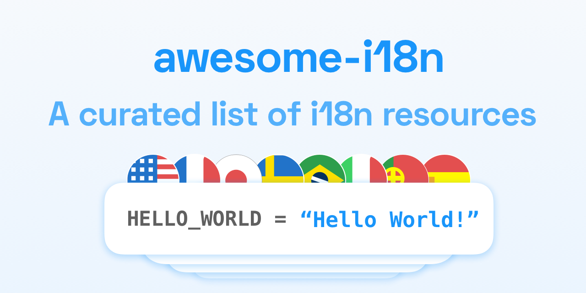

# awesome-i18n 

> A curated list of i18n tools, i18n libraries, localization software, localization programs and translation management systems.

## How to contribute

- do not add paid/freemium services
- do not add AI slop tools / libraries
- do not add libraries that required paid service to work
- keep your entry as short as possible (<150 chars)
- entry must be short enough to not wrap
- do not end your entry with a period
- try to keep it lowercase
- focus on what is unique, rather than generic message
- feel free to add more cateogories

## Remember to give this repo a star! 🌟

## 📦 Libraries

### JavaScript / TypeScript

- [MessageFormat2](https://messageformat.unicode.org) - full featured localization system, from Unicode
- [date-formatter-i18n](https://github.com/asmaelabid/date-formatter-i18n) - lightweight library for formatting dates with i18n support, relative time
- [airbnb.io/polyglot.js](http://airbnb.io/polyglot.js/) - tiny i18n helper, works in browser and CommonJS environment
- [VoerkaI18n](https://zhangfisher.github.io/voerka-i18n/) - internationalization solution for JavaScript projects
- [eo-locale](https://github.com/ibitcy/eo-locale) - elegant lightweight library based on internationalization API
- [MDN: Intl object](https://developer.mozilla.org/en-US/docs/Web/JavaScript/Reference/Global_Objects/Intl) - documentation for standard `intl` object from JavaScript
- [MDN: i18n](https://developer.mozilla.org/en-US/docs/Mozilla/Add-ons/WebExtensions/API/i18n) - internationalize your browser extension. APIs to get localized strings from locale files
- [FormatJS](https://formatjs.io) - internationalize your web apps on the client & server
- [FormatJS CLI](https://formatjs.io/docs/tooling/cli/) - extract messages from project with FormatJS library
- [i18next](https://www.i18next.com) - internationalization framework for browser or any other JavaScript environment
- [locale-lint](https://github.com/francisojeah/locale-lint) - detect missing keys, unused translations, hardcoded strings, interpolation mismatches
- [locakit](https://github.com/berkayyalcin7/locakit) - i18n engine for key diffing, lockfile staleness tracking, placeholder, glossary checks
- [intljulep](https://github.com/laurentpayot/intljulep) - super lightweight yet powerful i18n library
- [zero-intl](https://github.com/zero-intl/zero-intl) - dead simple library for modern apps
- [jquery/globalize](https://github.com/jquery/globalize) - library for i18n that leverages the official Unicode CLDR JSON data
- [intlayer](https://intlayer.org) - per-component translations for JavaScript projects
- [Jed](https://github.com/messageformat/Jed/) - gettext style i18n library
- [lisan.js](http://lisanjs.com) - fast and small i18n library
- [js-lingui](https://github.com/lingui/js-lingui) - readable, automated, and optimized internationalization
- [npm i18n](https://www.npmjs.com/package/i18n) - lightweight simple translation module with dynamic JSON storage
- [ttag](https://ttag.js.org/) - library for translations based on template literals
- [typesafe-i18n](https://github.com/ivanhofer/typesafe-i18n) - type-safe, lightweight localization library for TypeScript with no external dependencies
- [schummar-translate](https://github.com/schummar/schummar-translate) - TypeScript powered translation library for React and Node.js
- [messageformat](https://github.com/messageformat/messageformat) - ICU MessageFormat for JavaScript, plural and gender capable messages
- [rosetta](https://github.com/lukeed/rosetta) - A general purpose internationalization library in ~300 bytes (including dependencies)
- [ilingo](https://ilingo.tada5hi.net) - framework-agnostic i18n core with pluggable stores, BCP-47 fallback and Intl-native plurals & formatters
- (archived) [Intl.js](https://github.com/andyearnshaw/Intl.js) - implementation of the ECMAScript Internationalization API
- (archived) [facebook/fbt](https://github.com/facebook/fbt) - i18n framework for JS/TS designed to be powerful, flexible, simple and intuitive

### React framework

- [general translation](https://github.com/generaltranslation/gt) - component translation for Next.js with SSR/SSG
- [next-translate](https://github.com/vinissimus/next-translate) - easy i18n for NextJS, ~1kb of size
- [next-intl](https://github.com/amannn/next-intl) - minimal solution for internationalization in Next.js
- [react-translate](https://github.com/bloodyowl/react-translate) - internationalization for React
- [react-native-localize](https://github.com/zoontek/react-native-localize) - toolbox for your React Native app localization
- [react-localization](https://github.com/stefalda/react-localization) - translate using the same syntax as used in ReactNativeLocalization
- [react-intl](https://formatjs.io) - internationalize your web apps with react-intl library
- [react-intl (CLI)](https://formatjs.io/docs/tooling/cli/) - extract messages from project with FormatJS library
- [react-intl-hooks](https://github.com/CreateThrive/react-intl-hooks) - small and fast library that you can use to replace FormatJS components
- [react-i18nify](https://github.com/sealninja/react-i18nify) - simple i18n translation and localization components and helpers for React
- [react-i18next](https://react.i18next.com/) - internationalization framework for React and React Native which is based on i18next
- [react-i18n-mini](https://github.com/SanichKotikov/react-i18n-mini) - tiny (~2.39 kB) internationalisation library for React
- [react-persian](https://github.com/evandhq/react-persian) - set of react components for Persian localization
- [react-translated](https://github.com/amsul/react-translated) - dead simple way to add complex translations
- [react-localize-redux](https://github.com/ryandrewjohnson/react-localize-redux) - localization library for handling translations
- [react-translate-component](https://github.com/martinandert/react-translate-component) - component that utilizes the Counterpart/Interpolate components
- [react-littera](https://github.com/DRFR0ST/react-littera) - lightweight library for i18n using hooks
- [talkr](https://github.com/DoneDeal0/Talkr) - light i18n provider for React (< 1kb), Typescript, smart autocompletion, plural rules

#### Other JS/TS frameworks 

- (Angular) [ngx-translate](https://github.com/ngx-translate/core) - i18n for Angular
- (Angular) [transloco](https://github.com/jsverse/transloco) - i18n for Angular
- (Angular) [ng-extract-i18n-merge](https://github.com/daniel-sc/ng-extract-i18n-merge) - manage translation files for native Angular CLI i18n
- (Svelte) [svelte-i18n](https://github.com/kaisermann/svelte-i18n) - i18n for Svelte
- (VueJS) [vue-i18n](https://github.com/intlify/vue-i18n) - i18n for VueJS
- (VueJS) [sweet-i18n](https://github.com/wood3n/sweet-i18n) - automatic extraction and conversion of Chinese characters in Vue/JS files

### Java 

- [Thymeleaf](https://www.thymeleaf.org) - modern server-side Java template engine for both web and standalone environments
- [Thymeleaf i18n docs](https://www.thymeleaf.org/doc/tutorials/3.0/usingthymeleaf.html#using-texts) - how to use `th:texts` for translations
- [Spring Messages](https://www.baeldung.com/spring-boot-internationalization) - Spring Boot internationalization, LocaleResolver & LocaleChangeInterceptor usage
- [Spring Boot localization](https://www.baeldung.com/spring-boot-internationalization) - Baeldung post about using Spring Messages
- [i18n in Spring Boot](https://stackoverflow.com/questions/36531131/i18n-in-spring-boot-thymeleaf) - StackOverflow thread about i18n in Spring Boot
- [Java Time Classes](https://stackoverflow.com/questions/5175728/how-to-get-the-current-date-time-in-java/5175900) - Stackoverflow thread about time and timezones
- (image) [Java time classes](https://github.com/oh-jon-paul/awesome-i18n/blob/main/time-api.png) - table with date-time classes

### Swift

- [SwiftGoogleTranslate](https://github.com/maximbilan/SwiftGoogleTranslate) - framework to use cloud translation API by Google in Swift

### Ruby

- [Twitter/CLDR](https://github.com/twitter/twitter-cldr-rb) - ICU implementation that uses the CLDR to format dates, plurals
- [Ruby i18n](https://guides.rubyonrails.org/i18n.html) - official internationalization API document page

### Python

- [Python-i18n](https://pypi.org/project/python-i18n/) - internationalization package
- [deep-translator](https://github.com/nidhaloff/deep-translator) - library to translate between different languages in a simple way using multiple translators
- [LangLint](https://github.com/HzaCode/Langlint) - high-performance Rust-powered automated translation tool for code comments and docstrings

### Jekyll

- [jekyll-multiple-languages-plugin](https://github.com/kurtsson/jekyll-multiple-languages-plugin) - Jekyll Multiple Languages is an internationalization plugin
- (archived) [jekyll-i18n](https://github.com/liamzebedee/jekyll-i18n) - Jekyll i18n is a plugin that enables simplistic multi-language site designs

## 📅 Utility libraries

- (JS) [Luxon](https://moment.github.io/luxon/) - powerful, modern, and friendly wrapper for JavaScript dates and times (replaces momentjs)
- (JS) [date-fns](https://date-fns.org) - JavaScript library for dates
- (JS) [googlei18n/libphonenumber](https://github.com/googlei18n/libphonenumber) - parsing, formatting, and validating phone numbers (Java, C++, JavaScript) 
- (JS) [intl-tel-input.com](https://intl-tel-input.com/) - JavaScrript library for validating international phone numbers
- (JS) [anywhen](https://github.com/kirilinsky/anywhen) - relative and absolute fuzzy date formatting for any language, zero deps, native Intl
- (JS) [FormatJS CLI](https://formatjs.io/docs/tooling/cli/) - extract messages from project with FormatJS library

## Apps and extensions for translation management

- [POEditor](https://poeditor.com) - tool for managing PO language files
- [SimpleLocalize.io](https://simplelocalize.io) - dead simple app for managing translations and markdowns
- [Dire](https://github.com/juliandreas/dire-cli) - cli that processes missing translations in JSON files using AI
- [IntelliJ plugin for extracting i18n keys](https://github.com/nyavro/i18nPlugin) - IntelliJ IDEA plugin for extracing i18n keys
- [Crow Translate](https://github.com/crow-translate/crow-translate) - lightweight desktop translator
- [Copy Translator](https://github.com/CopyTranslator/CopyTranslator) - cross-platform app that automatically translate texts when copied
- [Argos Translate](https://github.com/argosopentech/argos-translate) - open source offline translation app based on OpenNMT
- [NRG](https://github.com/nanolaba/readme-generator) - template engine that generates multi-language markdowns
- [ai-i18n](https://github.com/i18n-actions/ai-i18n) - GitHub Action that translates i18n files (XLIFF, JSON) using LLM providers
- [i18n Checker](https://github.com/theluckystrike/bln-i18n-checker) - GitHub Action that detects hardcoded user-facing strings in JS/TS
- [gettext](http://www.gnu.org/software/gettext) - tool for adding native language support to applications
- [i18n-ally](https://github.com/antfu/i18n-ally) - VS Code extension for i18n
- [i18n-inline-editor](https://github.com/thezuck/i18n-inline-editor-vite-demo) - inline translation editor for Vite
- [RTranslator](https://github.com/niedev/RTranslator) - simultaneous translator app for Android based on Google's API
- [Sherlock](https://inlang.com/m/rR7kp498g/app-inlang-ideExtension) - VS Code extension for i18n
- [ElectronJS i18n](https://www.electronjs.org/apps/i18n-manager) - cross-platform i18n manager
- [OmegaT](https://omegat.org) - free translation memory application that works on all popular operating systems
- [LibreTranslate](https://github.com/uav4geo/LibreTranslate) - self-hosted web application to translate texts
- [LRM](https://github.com/nickprotop/LocalizationManager) - cross-platform CLI for managing JSON (i18next compatible) and .resx localization files
- [Fink](https://inlang.com/m/tdozzpar/app-inlang-editor) - git-based editor in the browser that connects to your repo
- [i18n-convert](https://github.com/i18n-agent/i18n-convert) - cli that losslessly converts between i18n file formats

## Text translation services
- [DeepL](https://deepl.com) - text translation service
- [Google Translate](https://translate.google.com) - text translation service
- [Microsoft Translator](https://www.microsoft.com/en-GB/translator/) - text translation service
- [Gengo](http://gengo.com) - translation made by real people, but you can make an order using API

## Other

- [fakenumber.org](https://fakenumber.org) - fake phone number generator

## 📚 Resources

- [Stackoverflow: Localization vs Internationalization](https://stackoverflow.com/questions/506743/localization-and-internationalization-whats-the-difference)
- [Stackoverflow: Daylight saving time and time-zone best practices](http://stackoverflow.com/questions/2532729/daylight-saving-time-and-time-zone-best-practices)
- [Blog post: Top 12 libraries for React localization](https://dev.to/jpomykala/top-12-libraries-for-nextjs-react-apps-and-react-native-apps-for-i18n-and-react-localization-5fi8)
- [Blog post: Building a minimal i18n library](https://janmonschke.com/building-a-minimal-i18n-library)
- [Blog post: Generating images with multi-language texts](https://bannerly.io/blog/posts/multi-language-image-variants/)
- [Blog post: Language vs Locale](https://simplelocalize.io/blog/posts/language-vs-locale/)
- [Blog post: Development/Production parity for Rails i18n](https://withatwist.dev/the-12-factor-app-dev-and-prod-parity.html)
- [Blog post: What is 'hreflang' attribute](https://simplelocalize.io/blog/posts/what-is-hreflang/)
- [Blog post: i18n with React Intl and SimpleLocalize](https://dujushi.github.io/2021/04/14/i18n-with-react-intl-and-simple-localize.html)
- [GitHub: FormatJS example project](https://github.com/simplelocalize/simplelocalize-react-intl)
- [GitHub: i18next example project](https://github.com/simplelocalize/simplelocalize-i18next)
- [Guide: Google Developers - Internationalization](https://developers.google.com/international/)
- [Guide: W3C i18n standards](https://www.w3.org/International/i18n-drafts/nav/about)
- [Guide: Common Language Data Repository](http://cldr.unicode.org/)
- [ICU: International Components for Unicode](http://site.icu-project.org/)

## 💭 Community tips & tricks

> If you have tight layouts, my rough rule of thumb is to double the English text and make sure it fits. Then you will usually have enough space for translations.

> Russian and German tend to have the longest translations, and the longest words. Get familiar with the shy-hyphen `&shy;` character. You put it in the word's html and it will only break the word/show the hyphen when necessary. Google “online hyphenation tool” so you know the appropriate places to break the word.

> You need to translate numbers with decimals and commas because they are reversed in some languages (period appears as a comma, comma as a period). Same goes for percent signs. Sometimes the % shows before the number, and not after. There might be a space between the number and %. It might show as %-KAL in Hungarian.

> Greek question marks look like a semicolon.

> Always keep datetimes in database in UTC. Always return datatimes from backend in UTC. Adjust datetimes on UI layer using timezone information from user or web browser. Accept datetimes in backend with any timezone.

## 🍿 Videos

- [Internationalis(z)ing Code - Computerphile](https://www.youtube.com/watch?v=0j74jcxSunY)

  
- [The Problem with Time & Timezones - Computerphile](https://www.youtube.com/watch?v=-5wpm-gesOY)

**Please avoid adding low-quality videos. Focus on high-level problems from trusted sources that will remain relevant over time.**

## 👩‍🎓 Acronyms and keywords

### 🧐 Acronyms
- i18n - internationalization
- l10n - localization
- xl8 - group of translation management systems
- t9n - translation
- g11n - globalization
- m17n - multilingualization
- ICU - International Components for Unicode
- TMS - translation management system
- GMS - globalization translation system (same thing as TMS)

### 🔑 Keywords
- translation key - element in source code which is used by i18n library to replace it with translation message
- translation - translated text or message

